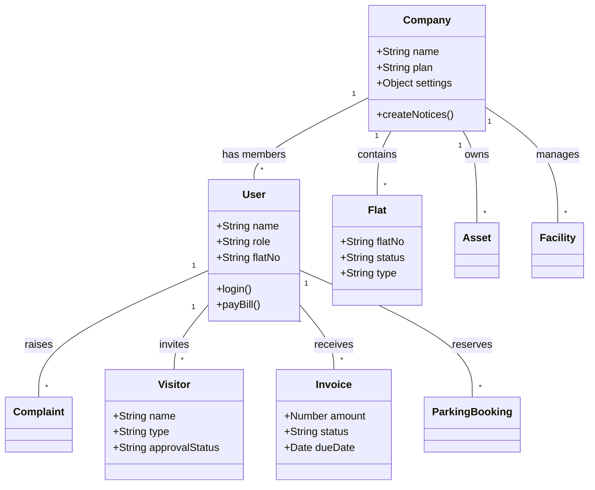
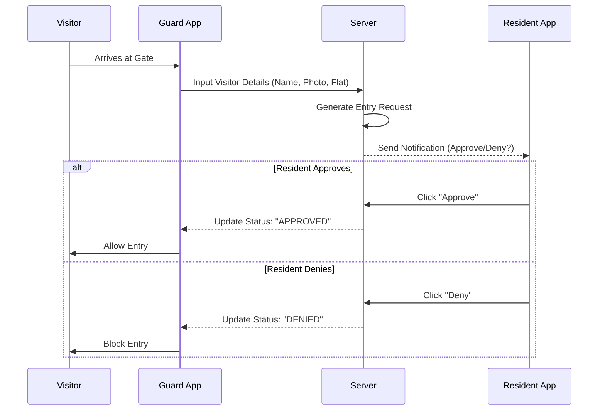
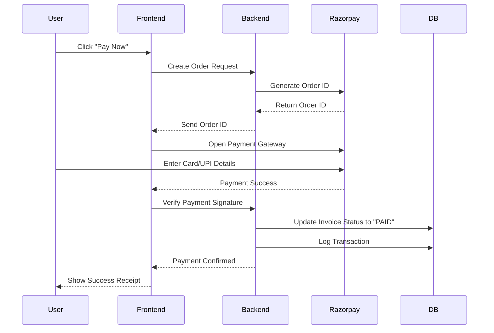
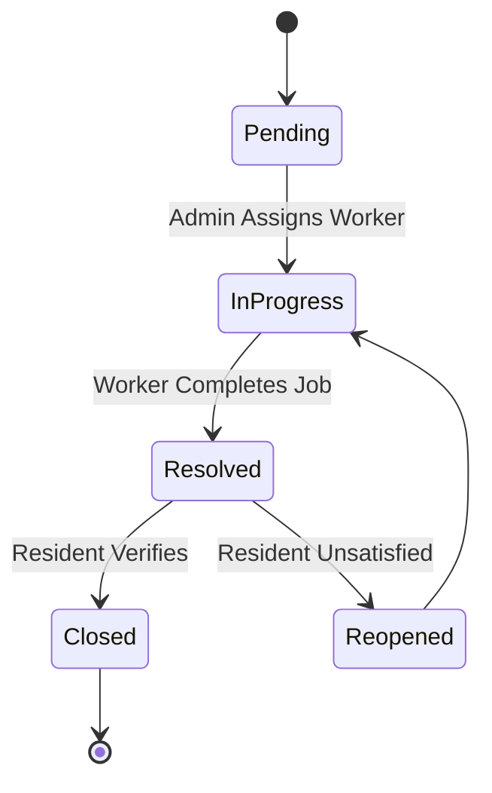
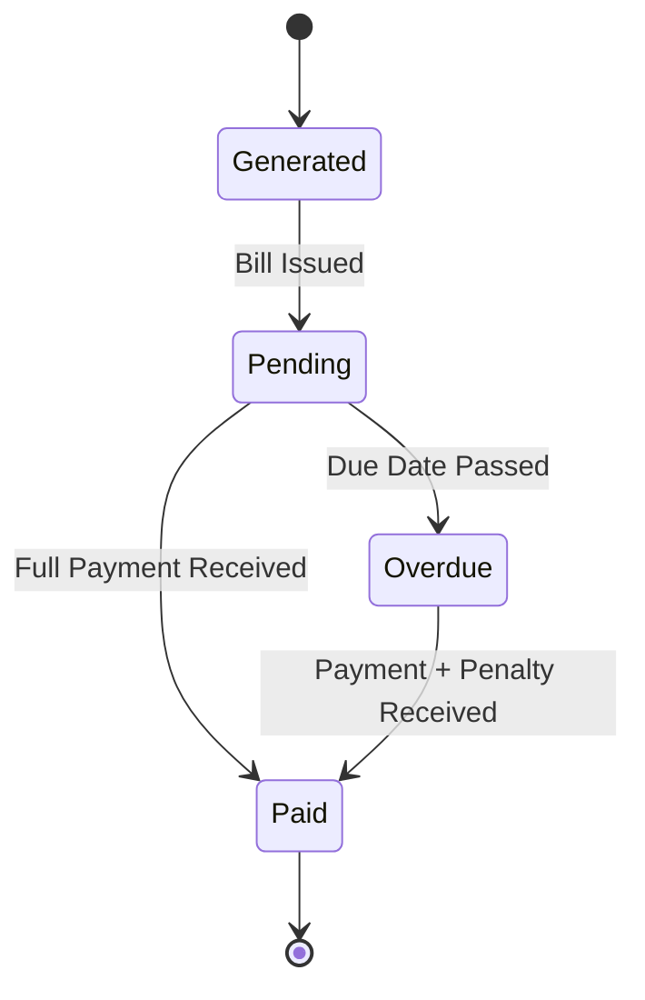
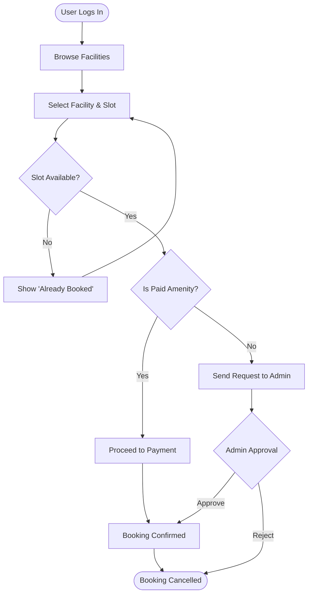
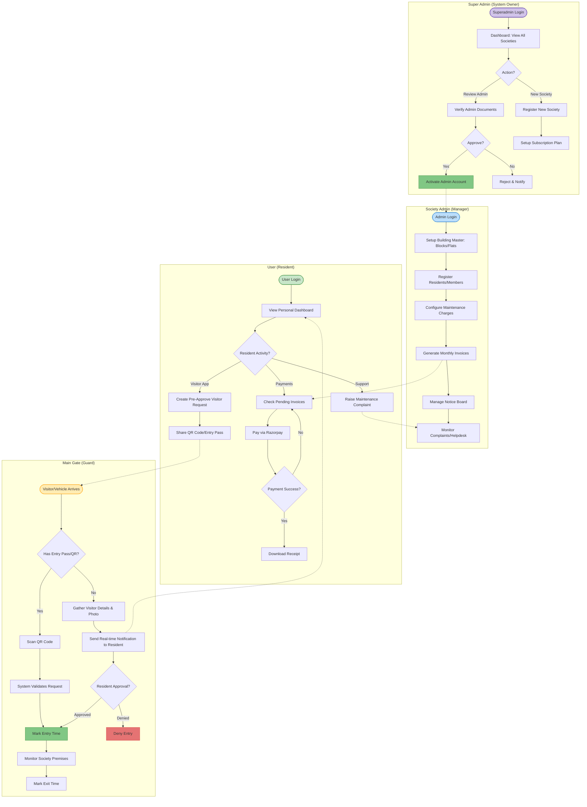

# 📊 Complete Project UML Diagrams

This document contains a comprehensive set of UML diagrams for the **Society Management System (Nexus OS)**. These diagrams cover structure, behavior, and interactions within the system.

> **Note:** You can view these diagrams visually by installing the **"Markdown Preview Mermaid Support"** extension in VS Code.

---

## 1. 🏗️ Class Diagram (Structural)
Represents the database schema and relationships between active entities.



---

## 2. 👤 Use Case Diagram (Functional)
Shows the interactions between different actors (Users) and the system.

```mermaid
usecaseDiagram
    actor "Super Admin" as SA
    actor "Society Admin" as Admin
    actor "Resident" as User
    actor "Security Guard" as Guard

    package "Nexus OS System" {
        usecase "Manage Societies" as UC1
        usecase "Manage Users & Flats" as UC2
        usecase "Generate Bills & Expenses" as UC3
        usecase "Pay Maintenance" as UC4
        usecase "Book Amenities" as UC5
        usecase "Approve Visitors" as UC6
        usecase "Log Entry/Exit" as UC7
        usecase "Raise Complaints" as UC8
        usecase "View Analytics" as UC9
    }

    SA --> UC1
    SA --> UC9
    
    Admin --> UC2
    Admin --> UC3
    Admin --> UC9
    
    User --> UC4
    User --> UC5
    User --> UC6
    User --> UC8
    
    Guard --> UC7
    Guard --> UC6
```

---

## 3. 🔄 Sequence Diagram: Visitor Entry Flow
Detailed flow of how a visitor entry is processed and approved.



---

## 4. 🔄 Sequence Diagram: Bill Payment Flow
Process of paying maintenance bills via Razorpay.



---

## 5. 🚦 State Diagram: Complaint Lifecycle
The different states a complaint ticket goes through.



---

## 6. 🚦 State Diagram: Invoice Status
Lifecycle of a monthly maintenance bill.



---

## 7. 🏃 Activity Diagram: Facility Booking
Step-by-step workflow for booking a common amenity (e.g., Clubhouse).



---

## 8. 🧩 Component Diagram (Architecture)
High-level architectural view of the Nexus OS tech stack.

```mermaid
componentDiagram
    package "Frontend Client" {
        [React App (Vite)]
        [Socket.io Client]
    }
    
    package "Backend Server" {
        [Express API]
        [Socket.io Server]
        [Auth Middleware]
    }
    
    package "Data Layer" {
        [MongoDB Atlas]
        [File Storage (Multer)]
    }
    
    package "External Services" {
        [Razorpay Gateway]
        [Nodemailer (SMTP)]
    }

    [React App (Vite)] --> [Express API] : HTTP/REST
    [React App (Vite)] <..> [Socket.io Server] : WebSocket (Real-time)
    [Express API] --> [MongoDB Atlas] : Mongoose
    [Express API] --> [Razorpay Gateway] : Payments
    [Express API] --> [Nodemailer (SMTP)] : Emails
```

---

## 9. 🏃 Activity Diagram with Swimlanes (Full Workflow)
Divided into Superadmin, Admin, User (Resident), and Main Gate (Guard) roles.

```mermaid
flowchart TD
    %% Define Swimlanes using subgraphs
    subgraph Superadmin
        SA_Start([Start]) --> SA1[Create Society Profile]
        SA1 --> SA2[Review & Approve Admin Account]
    end

    subgraph Admin
        SA2 --> A1[Manage Member Registration]
        A1 --> A2[Generate Monthly Maintenance Bills]
    end

    subgraph User
        U1[Login to Resident Portal] --> U2[Pay Maintenance Bill]
        U2 --> U3[Raise 'Visitor Entry' Request]
    end

    subgraph "Main Gate (Guard)"
        U3 --> G1[Receive Visitor Notification]
        G1 --> G2{Verify with Resident}
        G2 -- Authorized --> G3[Mark Entry Time]
        G3 --> G4[Mark Exit Time]
        G2 -- Denied --> G5[Deny Entry]
        
        G4 --> End([End])
        G5 --> End
    end

    %% Formatting
    style SA_Start fill:#f9f,stroke:#333,stroke-width:2px
    style End fill:#f9f,stroke:#333,stroke-width:2px
    style Superadmin fill:#f5f5f5,stroke:#333,stroke-width:1px
    style Admin fill:#e3f2fd,stroke:#333,stroke-width:1px
    style User fill:#f1f8e9,stroke:#333,stroke-width:1px
    style "Main Gate (Guard)" fill:#fff3e0,stroke:#333,stroke-width:1px
```

---

## 10. 📊 Detailed System Activity Diagram (Comprehensive Workflow)
This diagram provides a deep dive into the business logic across all four major roles.




